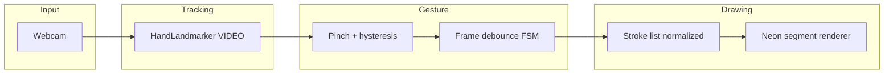

# Air Canvas

Hand-tracked **air drawing** in the browser: webcam → [MediaPipe Hand Landmarker](https://ai.google.dev/edge/mediapipe/solutions/vision/hand_landmarker/web_js) → normalized landmarks → pinch gesture → persistent neon strokes on canvas.

Built to demo well in a portfolio: clear architecture, deliberate gesture debouncing, and a polished dark UI.

## Quick start

```bash
npm install
npm run dev
```

Open the local URL (or your deployed site), allow camera access, then follow **Using the app** below.

## Using the app (for users)

1. **Open the page** in a recent desktop browser (Chrome or Edge work well). The site must be **HTTPS** or **localhost** so the browser allows the webcam.
2. When prompted, **Allow** camera access. If you denied it before, use the lock icon in the address bar to reset permissions.
3. **Face the webcam** and raise one hand. **Mirror** (on by default) should feel natural, like a mirror: your hand moves the same way you expect.
4. **Draw:** bring **thumb tip and index tip** together (a pinch). Hold that pinch and move your hand — the **index fingertip** is the pen. **Open** the pinch (spread thumb and index) to lift the pen off the canvas.
5. **Erase:** choose **Erase**, pinch again, and move over ink you want to remove.
6. **Toolbar**
   - **Draw / Erase** — mode
   - **Colored dots** — ink color (draw mode)
   - **Brush** — line thickness
   - **Dim** — darken the camera so neon strokes stand out
   - **Mirror** — flip the video horizontally (recommended for selfie cam)
   - **Hide cam** — keep tracking but hide the video (ink still works)
   - **Debug** — optional hand skeleton overlay (for tuning / demos)
   - **Diagnose** — live pinch distance and why a stroke stopped (if lines “break,” use this)
   - **Undo** — remove last finished stroke
   - **Clear** — wipe the canvas
   - **Save PNG** — download the drawing (transparent where there is no ink over the dim layer; mostly you get the neon layer as exported)

**Tips:** Good lighting on your hand helps. If the line keeps stopping, turn on **Diagnose** — a rising **pinch** number usually means you’re opening the pinch slightly; **hand-gap** means the tracker lost your hand for a moment.

## Stack

- **React 19** + **Vite** + **TypeScript**
- **@mediapipe/tasks-vision** (WASM + `hand_landmarker.task` from Google’s model bucket)
- Layered **HTML canvas**: video → dim overlay → persistent paint → per-frame overlay (cursor + optional skeleton)

## Architecture



- **Coordinates**: Landmarks are normalized to the video frame. Mapping uses an **object-fit: cover** transform so canvas pixels line up with what you see, with optional **horizontal mirroring** for selfie UX.
- **Strokes** are stored in **normalized space** so undo/redraw stays consistent when the stage resizes.
- **Neon look**: wide, soft shadow passes + a bright core (`src/lib/renderNeon.ts`).

## Project layout

| Path | Role |
|------|------|
| `src/components/AirCanvas.tsx` | Video stack, rAF loop, MediaPipe, gesture + paint |
| `src/lib/coords.ts` | Cover + mirror mapping |
| `src/lib/pinch.ts` | Thumb–index distance + Schmitt-style thresholds |
| `src/lib/gestureMachine.ts` | Stable enter/exit frame counts |
| `src/lib/smoothing.ts` | Exponential smoothing in normalized space |
| `src/lib/strokeModel.ts` | Stroke type + canvas projection |
| `src/lib/renderNeon.ts` | Glow + erase composite |

## Deploying (e.g. GitHub Pages)

The app loads WASM and the `.task` model from **CDNs**; hosting must be served over **HTTPS** (or `localhost`) for `getUserMedia`.

For a subpath deploy, set `base` in `vite.config.ts` (e.g. `base: '/air-canvas/'`).

## License

MIT (app code). MediaPipe models and runtime are subject to [their license](https://www.npmjs.com/package/@mediapipe/tasks-vision).
