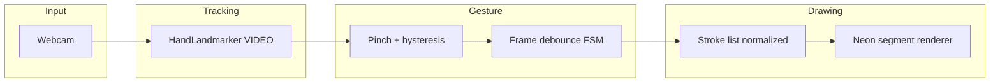

# Air Canvas

Hand-tracked **air drawing** in the browser: webcam → [MediaPipe Hand Landmarker](https://ai.google.dev/edge/mediapipe/solutions/vision/hand_landmarker/web_js) → normalized landmarks → pinch gesture → persistent neon strokes on canvas.

Built to demo well in a portfolio: clear architecture, deliberate gesture debouncing, and a polished dark UI.

## Quick start

```bash
npm install
npm run dev
```

Open the local URL, allow camera access, then **pinch thumb and index finger** to draw and release to lift the pen.

## Stack

- **React 19** + **Vite** + **TypeScript**
- **@mediapipe/tasks-vision** (WASM + `hand_landmarker.task` from Google’s model bucket)
- Layered **HTML canvas**: video → dim overlay → persistent paint → per-frame overlay (cursor + optional skeleton)

## Architecture



- **Coordinates**: Landmarks are normalized to the video frame. Mapping uses an **object-fit: cover** transform so canvas pixels line up with what you see, with optional **horizontal mirroring** for selfie UX.
- **Strokes** are stored in **normalized space** so undo/redraw stays consistent when the stage resizes.
- **Neon look**: wide, soft shadow passes + a bright core (`src/lib/renderNeon.ts`).

## Project layout

| Path | Role |
|------|------|
| `src/components/AirCanvas.tsx` | Video stack, rAF loop, MediaPipe, gesture + paint |
| `src/lib/coords.ts` | Cover + mirror mapping |
| `src/lib/pinch.ts` | Thumb–index distance + Schmitt-style thresholds |
| `src/lib/gestureMachine.ts` | Stable enter/exit frame counts |
| `src/lib/smoothing.ts` | Exponential smoothing in normalized space |
| `src/lib/strokeModel.ts` | Stroke type + canvas projection |
| `src/lib/renderNeon.ts` | Glow + erase composite |

## Deploying (e.g. GitHub Pages)

The app loads WASM and the `.task` model from **CDNs**; hosting must be served over **HTTPS** (or `localhost`) for `getUserMedia`.

For a subpath deploy, set `base` in `vite.config.ts` (e.g. `base: '/air-canvas/'`).

## License

MIT (app code). MediaPipe models and runtime are subject to [their license](https://www.npmjs.com/package/@mediapipe/tasks-vision).
